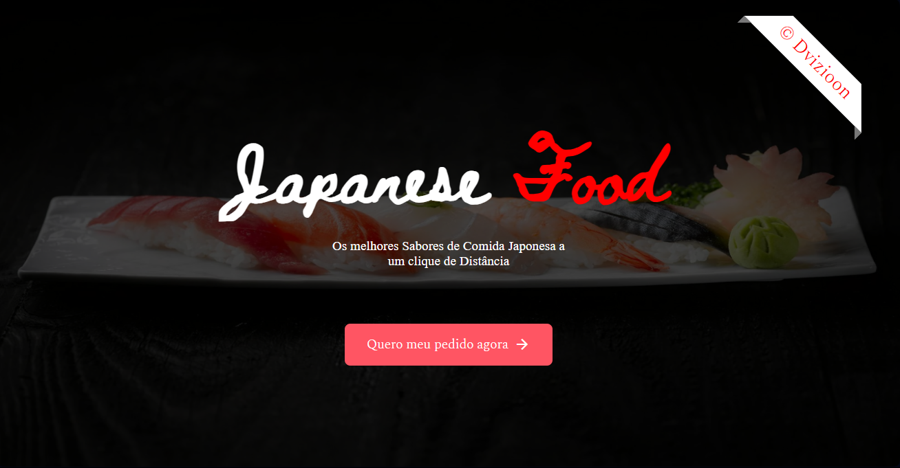
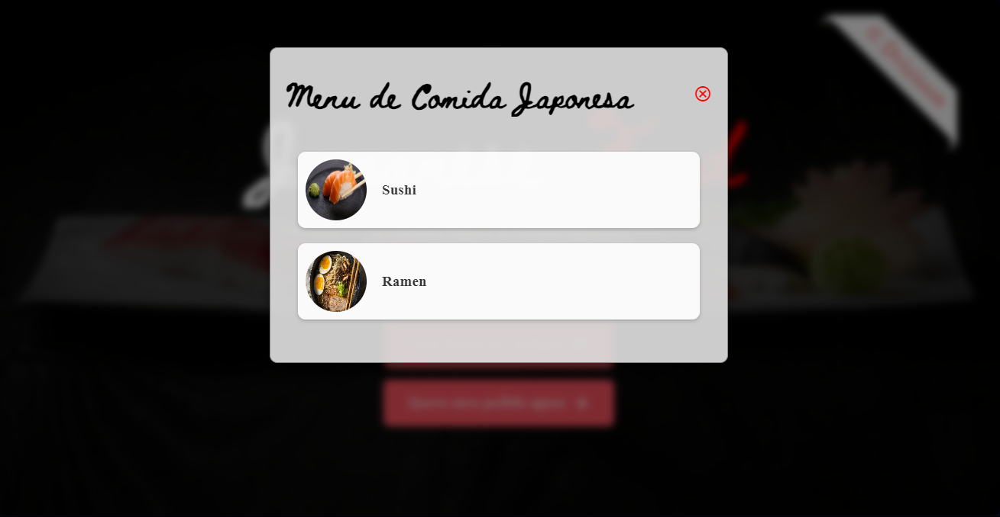
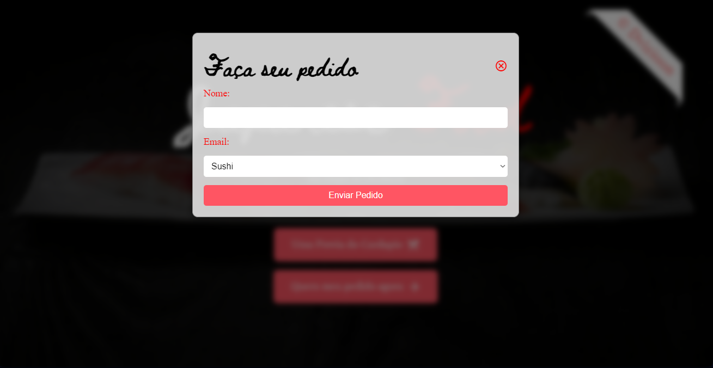

# 🍣 Japanese Food Landing Page



Bem-vindo ao projeto da Landing Page de Comida Japonesa! Esta página é dedicada aos amantes da culinária japonesa, oferecendo uma experiência visual incrível e informações deliciosas sobre a gastronomia do Japão.

## 🌸 Índice

- [Descrição](#descrição)
- [Tecnologias Utilizadas](#tecnologias-utilizadas)
- [Instalação](#instalação)
- [Como Usar](#como-usar)
- [Licença](#licença)
- [Contato](#contato)

## 📖 Descrição

Esta landing page apresenta um atraente layout com um botão para navegar e explorar a comida japonesa.




## 🛠️ Tecnologias Utilizadas

- **HTML5**: Estrutura da página.
- **CSS3**: Estilos e layout.

## 🚀 Instalação

Para rodar este projeto localmente, siga estas etapas:

1. Clone o repositório:
    ```bash
    git clone https://github.com/dvizioon/LANDING-PAGE-JAPANESE-FOOD.git
    ```

2. Navegue até o diretório do projeto:
    ```bash
    cd LANDING-PAGE-JAPANESE-FOOD
    ```

3. Abra o arquivo `index.html` no seu navegador preferido.

## 🖥️ Como Usar

- **Clique** no botão presente na página para navegar e explorar a comida japonesa.

## 📄 Licença

Este projeto está sob a licença MIT. Veja o arquivo [LICENSE](LICENSE) para mais detalhes.

## 📬 Contato

Para quaisquer dúvidas ou sugestões, sinta-se à vontade para entrar em contato:

- **Email**: danielestevao.projetos@gmail.com

---

